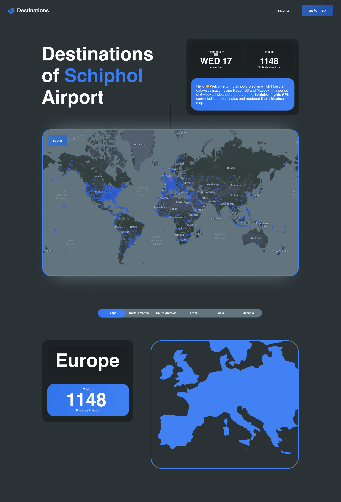

## Frontend apps

## Description

## Table of Contents

- [Install](#install)
- [Features](#features)
- [Used Tools](#used-tools)
- [Visuals](#visuals)
- [!important files](#mportant-files)
- [Meta](#meta)
- [License](#license)

## Install

Clone the GitHub Repo locally

```
git clone https://github.com/JuulVrasdonk/frondend-apps
```

Install the Packages

```
npm install
```

Start the Server

```
npm start
```

## Features

-

## Used Tools

- [git](https://git-scm.com/)
- [json](https://www.json.org/json-en.html)
- [mapbox](https://docs.mapbox.com/mapbox-gl-js/guides/)
- [react](https://reactjs.org)

## Visuals



## !mportant files

Of course all files are important but you should at least have a look at these files if you are interested in this repo.
Viewing these files will give you an idea of how this feature is built.

[Map.js](https://github.com/JuulVrasdonk/frontend-apps/blob/master/src/components/Map/Map.js)

[Insights.js](https://github.com/JuulVrasdonk/frontend-apps/blob/master/src/components/Insights/Tabs.js)

## Meta

Juul Vrasdonk - juulvrasdonk@gmail.com - https://github.com/JuulVrasdonk/frontend-apps

## License

Usage is provided under the [MIT License](https://github.com/git/git-scm.com/blob/master/MIT-LICENSE.txt) MIT. See [LICENSE](https://github.com/JuulVrasdonk/frontend-apps/blob/master/LICENSE) for the full details.
